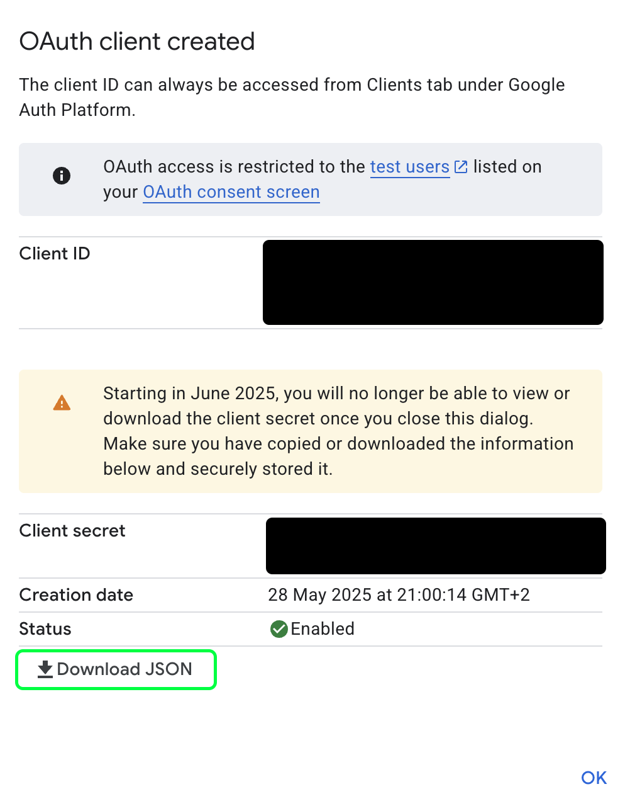
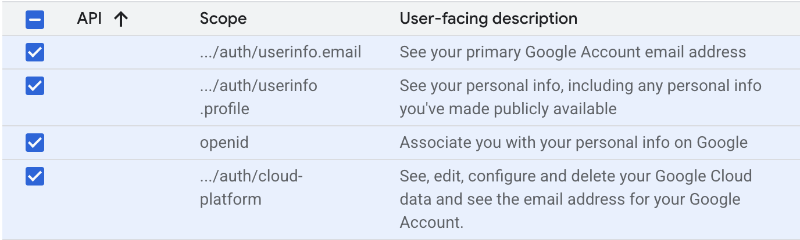

# Google Sheets API Setup
Google Sheets can be used as a data source within Dataflow. In fact, I mostly use Google Sheets as Database for my Projects, since its super convinient to have Google Sheets features, collect data from forms or web apps and/or share with others to work on. Also it gives you a better visualization and flexibility with your data than, lets say, a json file.

Dataflow comes with a "bring your own API Key" solution  when it comes to connecting with Google Sheets.
**Fortunately the Google Sheets API is free and easy to setup.**
Follow this guide closely, to properly setup the Sheets API to work with Dataflow.

## Setting Up a Google Cloud Project
In order to access your Google Sheets in Dataflow, you need to create a free Google Cloud Project.
This will be the endpoint which Dataflow will always connect to.
To create a Google Cloud Project, follow these steps:

1. Visit the [Google Cloud Console](https://console.cloud.google.com/).
2. Click on the **Create Project** button.
3. Provide a name for your project and select your organization (if applicable).
4. Click **Create** to finalize the setup.

## Creating Client Secret
Once your project is created, you can proceed with enabling the Google Sheets API.

1. In the Quick Access, click on "APIs and services"
2. Click on Credentials->Create credentials->OAuth client ID
3. In Application type select Desktop app and give the client a name if you want.
4. Create and download your client secret as a JSON and store it in a secure place on your machine.

{ width=300px }

!!! warning "Warning!"
    The client secret acts as a "password" for your application, allowing access to sensitive user data and making API requests over your application using your rate limits. Treat it with care and store it securely.

## Cloud Project settings
Now that you have your client secret, you need to set up the Cloud Project in a way so you login in the Dataflow extension with your Google account and retrieve the "token" to source your Google Sheet Data.

1. Navigate to "OAuth consent screen" ->"Branding"
2. Fill in your Email Adress in "User support email" and "Developer contact information".
3. In all three fields of the App Domain section, fill in your preferred localhost adress, e.g.: **http://localhost:8080**

Next we need to define what types of user data Dataflow can access in order to work like intended.

1. Navigate to the Data access menu.
2. Add the following scopes and save:

!!! info "Info"
    Dataflow connects to Google Sheets solely to read and write data as authorized by the user. It does not collect, or abuse any personal or sensitive user data and only accesses the specific Google Sheets content explicitly shared by the user for the extension's functionality. Its especially safe, since all the API traffic and Authentication is handled via your personal Google Cloud Project.

## Dataflow Google Sheet Settings
In the Dataflow extension

1. Navigate to Settings
2. In the Google Sheets section, select your client secret
3. Set the localhost server to the same one as in your Google Cloud Project
4. Press OK.

## Dataflow LogIn
Finally, we can connect to our Google Sheets Data.

1. Navigate to **Data**
2. Press the LogIn Button
3. LogIn with the Google Account you want to access the Sheets of
4. After authentication, paste the enitre adress bar content into the Token Alert Window.

If everything was setup correctly you should now see which Email adress you are logged in to and see all the Google Sheets that are owned by your account. Now you can Select them as a data source.

