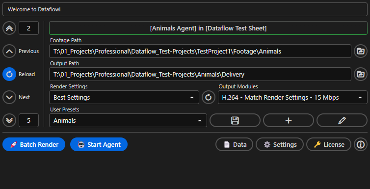

# Using Dataflow
!!! note ""
    Look of the UI is subject to changes, this should give you a basic Idea of the tools structure.

## User Interface
Dataflow aims to make the User experience as straight forward as possible, offering a simple UI with basic but powerful controls.

## Connecting Data

In order to connect a Local Data source or Google Sheet, press the ==📄 Data== Button at the bottom right of the UI.

You can connect either Local Data sources ==.tsv or .json== or a ==Google Sheet==.

**To connect local data sources:**  

1. Select your file/s in the file picker located in the ==Local Data== Menu at the bottom  
2. Then press the ==Connect Local Data== Button

If you want to connect to a Google Sheet [setting up a Google API](google-api.md) is required.  
But dont worry, its ==free==, ==really easy== and only needs to be ==setup once== at the beginning!

After following the Google Sheet API Setup, follow the authentication process ion your browser.
Then you can return to After Effects and can see all Goggle Sheets from your Google account.

!!! note
    Loading the Sheets could take a short amount of time, depending on the amount of Sheets and your internet connection speed!

**To connect a Google worksheet:**

1. Select and expand a Google Sheet  
2. Select your desired Worksheet
3. Press the ==+== Button to add it to your ==connected Sheets section==
4. Optinally, add multiple Worksheets if you are using the [Agent](agent.md)
5. Press the ==Connect Worksheet/s== Button

## Previewing Data

## User Presets